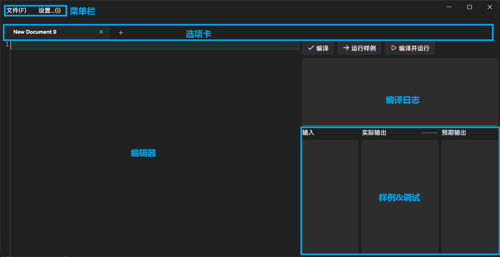

# 基本概念

接下来我们将介绍应用内的各个功能的基本用法。

## 主界面

运行应用后，您将会看到如下的窗口：

### 菜单栏

这里是放置应用快捷方式的地方。

### 选项卡

这里可以同时打开多份代码。

**👉️ 点击 `New Document 0` 右侧的 `+` 号新建一个页面。**

**👉️ 点击选项卡右侧的 `x` 关闭页面。**

### 编辑器

这里是编写代码的最重要部分。我们将在后面的章节详细介绍。

### 编译日志

通过这个面板，你可以查看代码的编译情况以及日志。我们将在后面的章节详细介绍。

### 样例&调试

这里是仅次于编辑器的重要部分，可帮助你快速调试代码。我们将在后面的章节详细介绍。

## 应用设置

**我们可以在应用设置中调整应用的各项设置。**

**🎉恭喜！至此您已经了解了 Zinc 的基本使用方法。**